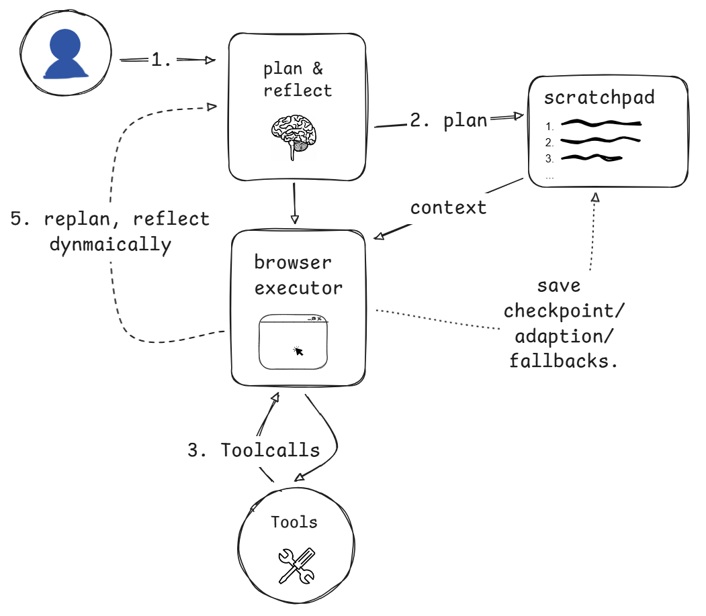

# 🌕 Orbit Agent
Orbit agent is a browser use agent, with advance programming techniques and agentic architecture to automate tasks in web browser with improved token utilization, accuracy, speed and reliability.

### About

Early on, I tried leveraging spatial understanding of LLMs to handle clicks, typing etc. in [browser-use](https://github.com/Veer376/browser-use) project. While it worked in principle, three issues stood out:
- Accuracy of coordinates: Models often misaligned labels and generated incorrect click positions.
- Performance trade-off: Using a separate segmentation model improved results, but it was slow and still misled by labels.
- Separate LLM: Relying on a single LLM to both decide the next action and generate its coordinates reduces reliability—the broader its role, the less precise it becomes. In my case it didn't work at all.

I ended up combining the best of both worlds. I can only share a few examples for now ——
- Dropdowns → DOM parsing shines here. The model has full visibility of all options and can select reliably without even opening the dropdown.
- When scrolling, the DOM representation falls short—since we can’t transmit every scroll detail to the LLM—making spatial understanding the superior approach.

The Second most important thing is the type of perception used for the model. The [browser-use](https://github.com/browser-use/browser-use) project uses DOM text, [notte](https://github.com/nottelabs/notte) flex that they are using markdown. I’ve experimented with multiple approaches—screenshots, ASCII art, and DOM text—and found that screenshots (after some preprocessing) are the most token-efficient and, more importantly, the most reliable way to interact with browsers. Instructions like ‘click on the profile at the right-hand side’ allow the LLM to ground its actions visually, making it robust even on unseen or complex websites. This level of grounding is only achievable through screenshots. That said, screenshots come with their own challenges.”

## Benchmarks
coming soon...

## ✨ Features

### 🤖 Agentic Architecture

📊 An agentic architecture has been implemented from scratch using LangGraph, leveraging checkpoints for state management and streaming for real-time interaction.

A dedicated scratchpad mechanism `save_to_scratchpad()` provides temporary context storage and manipulation. This allows the agent to record failures, adaptations, and fallbacks tied to the user’s task. By maintaining this contextual memory, the agent avoids repeating incorrect adaptations and can refine its behavior over time.
**For instance, if a 24-hour filter was previously chosen as a fallback due to the unavailability of a 3-day filter, the agent will not later misinterpret that decision as a mistake.**

🔄 To further strengthen adaptability, a Planner-Reflection node is integrated into the architecture. This enables the agent to replan tasks and reflect on prior actions, helping it escape local minima, reason beyond immediate context and execute longer tasks. In LangGraph, this reflection node is triggered either statically (e.g., after 6 steps) or dynamically (e.g., when consecutive failures occur or when the scratchpad records a threshold number of error commits).

### 🧰 Dynamic Tool Selection with Reserves

The project uses a tool_registry as the central controller for tool exposure. This registry filters tools dynamically based on the filter context (e.g., active domains, field focus state, browser conditions, and agent state). A lambda-driven condition system provides precise and composable logic, ensuring tools are revealed or hidden at exactly the right time. This has reduced the number of tool exposed to the model. **e.g. `press_key()` exposed only when textfield is focused.**
```python
@register(is_active=lambda ctx: ctx.step == 0) # e.g. exposing google search at the start only.
def google_search():
    pass
```
🔍 Extending this idea, a reservation mechanism (“Reserves”) refines tool selection by gating access based on situational factors such as browser state, agent state, or the complexity of the prior action. For instance, the find() tool can reveal find_by_selector() only when multiple elements are detected—nudging the LLM to reserve and then switch to the more specific tool.

**With tool reserves, I was able to exclude `select_dropdown_option` and `get_dropdown_options` from the initial exposure, saving tokens and preventing the model from misinterpreting dropdowns as text fields**. This mirrors a more human-like interaction pattern—we don’t know what we’re dealing with until we actually engage with it.

### 💬 Dynamic Prompt Injection
A message_registry has been implemented to track all active messages across different contexts. This allows the LLM to be prompted into specialized behaviors—for instance, pausing after three consecutive failures and switching into a reflection persona to diagnose the issue. This improves both accuracy and the ability to break out of loops.
```python
message_registry.register(
    message="""You have had multiple failures...""",
    is_active=lambda ctx: len(ctx.consecutive_failures) >= ctx.max_consecutive_failures,
) 
```
⚠️ Gemini Ghosting and [hallucinations](assets/gemini_hallucinations/) are common issues in LLMs. Issues such as ToolCallMissing() or InvalidToolCall() are handled gracefully through LLM escalation, ensuring smooth recovery. A custom `MessageException(Exception):` provides a clean, consistent framework for managing these error cases.
```python
if not tool_calls:
    raise ToolCallMissing()
```

### 🧠 Thought Control and SDK Integration
An enhanced chain of thought mechanism has been implemented with precise control over thoughts, thought signatures, and other low-level parameters. The integration is built closely on top of LangGraph’s native internals, wrapping the GenAI SDK to ensure full compatibility.

This is achieved through `GeminiMessage(AIMessage):`, which extends LangGraph’s message logic in a lightweight manner. A MessageBlueprint(message class build to pass on to next call) pattern eliminates redundancy (solving the DRY principle) and adheres to the open/closed principle, allowing easy extension for additional SDKs without modifying the existing core.
```python
class GeminiMessage(AIMessage):
    thought: str
    # preserve the part itself, as function call or text response might include thought signatures which should be passed in the same part for enhanced chain of thought.
    gemini_parts: list[types.PartDict] # make sure its PartDict and not Part so its serializable.
```
```python
class MessageBlueprintBase:
    # persona, ai_message, previous_action, scratchpad etc.

    @abstract_method
    def to_gemini_format(self):
        pass

    @abstract_method
    def to_langchain_format(self):
        pass

    # and others.
```